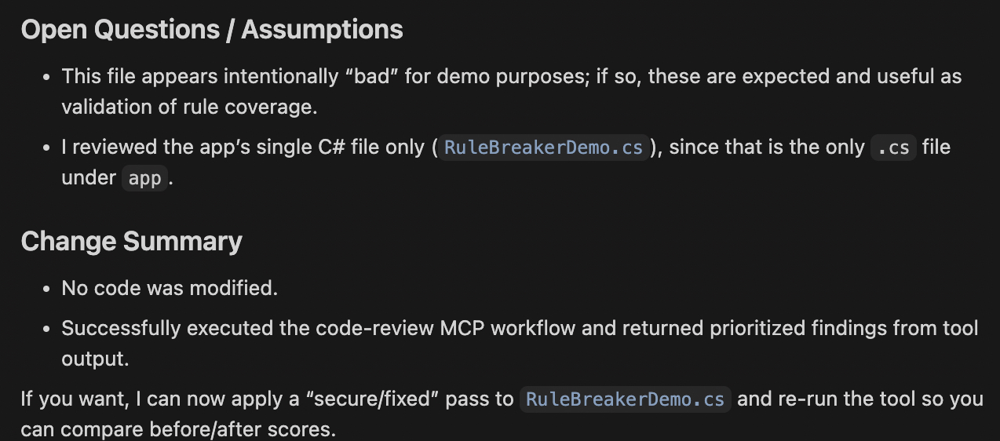

# MCP C# Code Review Server

## What This Project Is

This project is a production-ready MCP server built in C# and .NET. It provides automated code review tools focused on C# quality, security, async correctness, performance, maintainability, naming conventions, and project organization signals.

The server communicates over stdio transport, which makes it easy to plug into MCP-compatible AI clients.

## Tech Stack

[](https://learn.microsoft.com/dotnet/csharp/)
[](https://dotnet.microsoft.com/)
[](https://modelcontextprotocol.io/)
[](https://www.json.org/)
[](https://www.markdownguide.org/)
[](https://github.com/)

## AI Client Compatibility

This server can be connected to any MCP-compatible AI client app, including:

- Cursor
- Visual Studio Code MCP-capable clients
- Claude Code
- GitHub Copilot environments that support MCP
- Other MCP-compatible tools

If a client supports custom MCP server definitions (command + args), it can connect to this server.

## Main MCP Tools

### review_csharp_code

Reviews C# source input and returns structured JSON with:
- summary
- score
- issues list (severity, category, line, description, fix)
- invocationId (unique id per review request)
- totalRulesChecked / totalRulesMatched
- checkedCategories
- categoryScores (score + coverage per category)
- suggestedChanges (normalized list for easy rendering)

### health_check

Returns server health and timestamp.

### get_rule_backlog

Reads the Add New Rules sections from category markdown files and returns pending proposals as JSON.


## MCP Connection JSON

Use one of the following entries in your MCP client configuration.

### Option A: Run from csproj

```json
{
  "mcpServers": {
    "csharp-code-review": {
      "command": "dotnet",
      "args": [
        "run",
        "--project",
        "/absolute/path/to/McpCodeReviewServer.csproj"
      ]
    }
  }
}
```

### Option B: Run from built dll

```json
{
  "mcpServers": {
    "csharp-code-review": {
      "command": "dotnet",
      "args": [
        "/absolute/path/to/bin/Debug/net8.0/McpCodeReviewServer.dll"
      ]
    }
  }
}
```

For production use, prefer a Release build path:
- /absolute/path/to/bin/Release/net8.0/McpCodeReviewServer.dll

## Project Architecture

The project is organized by separation of concerns:

- Tools
  - MCP tool endpoints only
- Services
  - analysis engine, scoring, rule backlog reader, DI registration
- Rules
  - category-based providers and reusable rule abstractions
- Models
  - response contracts
- documentation/rule-catalog
  - rule documentation per category

## Current Rule Categories

- Async
- Security
- Performance
- Maintainability
- Method
- Type Design (class/interface/record)
- File and Folder
- CSharp Modernization

## Rule Documentation Workflow

Each rule category has a dedicated markdown file under documentation/rule-catalog.

Each category file has exactly two sections:

1. Existing Rules
- Rules already implemented in code.

2. Add New Rules
- Backlog entries for future implementation.
- The get_rule_backlog tool reads these entries.

You can extend the project by adding your own entries in the Add New Rules section of each category markdown file. This lets teams propose new checks without changing code first.

## How to Run Locally

### Prerequisites

- .NET SDK installed
- .NET 8 runtime (project targets net8.0)

### Build

dotnet build

### Run

dotnet run --project McpCodeReviewServer.csproj

## How to Connect an AI Client

1. Open your AI client MCP configuration.
2. Add one server entry using either the csproj or dll JSON from the top of this README.
3. Restart the client or reload MCP servers.
4. Verify the server is connected and tools are visible.
5. Call review_csharp_code with C# source content.

## Example review_csharp_code input shape

Send raw C# code as the code argument and optional maxIssues integer.

Example intent:
- code: full C# source
- maxIssues: 50

## Development Notes

- Rules are implemented as pluggable providers.
- Add new executable checks by creating or extending a provider in Rules.
- Register provider in Services/ServiceCollectionExtensions.cs.
- Keep docs in sync by updating the corresponding documentation/rule-catalog category file.

## Extending Rules via Markdown

To extend this project, open the category file in documentation/rule-catalog and add a new bullet under Add New Rules.

Suggested entry format:
- Rule name: <short rule title>; Category: <category>; Severity: <critical|warning|suggestion>; Detection: <pattern/condition>; Fix: <recommended action>

After adding entries, call get_rule_backlog to verify your new items are discoverable by MCP clients.

## Production Guidance

- Use Release build output for client integration.
- Pin package versions in CI.
- Add automated tests for each rule provider.
- Validate new rules against false positive and false negative scenarios.

## Author

Rikam Palkar is the author of this MCP C# Code Review Server, focused on building practical developer tooling for automated code quality, security, and maintainability checks.

## Detailed Architecture & Key Files

### Entry Point: Program.cs

**Purpose:** Initializes the MCP server, registers dependency injection, and configures stdio transport.

```csharp
var builder = Host.CreateApplicationBuilder(args);

builder.Services.AddCodeReviewEngine();
builder.Services
    .AddMcpServer()
    .WithStdioServerTransport()
    .WithTools<CodeReviewTool>();

await builder.Build().RunAsync();
```

This sets up the entire review pipeline with DI, registers the code review engine (rules + services), and starts the MCP server.

---

### MCP Tool Definition: Tools/CodeReviewTool.cs

**Purpose:** Exposes the two MCP tool methods that clients call: `review_csharp_code` and `get_rule_backlog`.

**Key Methods:**
- `ReviewCSharpCode(string code, int maxIssues)` — Returns JSON with summary, score, issues, categoryScores, and invocationId
- `GetRuleBacklog()` — Returns pending rule proposals from markdown documentation
- `HealthCheck()` — Returns server health and timestamp

```csharp
[McpServerTool(Name = "review_csharp_code")]
[Description("Reviews C# code for correctness, security, performance, maintainability, async behavior, and design rules. Returns structured JSON.")]
public string ReviewCSharpCode(
    [Description("Raw C# source code to review.")] string code,
    [Description("Maximum number of issues to return.")] int maxIssues = 50)
```

The tool coordinates three services: `IReviewAnalyzer`, `IReviewScorer`, and `IRuleBacklogService`.

---

### Rule Execution Engine: Services/ReviewAnalyzer.cs

**Purpose:** Executes all registered rules against the source code and collects findings.

**Key Method:**
- `Analyze(string code, int maxIssues) : ReviewAnalysisResult` — Normalizes code into lines, creates a RuleContext, runs every registered rule, and returns bounded findings

```csharp
public ReviewAnalysisResult Analyze(string code, int maxIssues)
{
    var normalizedMax = Math.Max(1, maxIssues);
    var lines = NormalizeLines(code);
    var context = new RuleContext(code, lines);

    foreach (var rule in _rules)
    {
        var category = string.IsNullOrWhiteSpace(rule.Category) ? "uncategorized" : rule.Category;
        // Execute each rule and collect issues
    }
}
```

It groups findings by category and category name for scoring later.

---

### Scoring Engine: Services/ReviewScorer.cs

**Purpose:** Calculates the overall review score (0-10) and per-category scores.

**Key Methods:**
- `CalculateScore(IReadOnlyCollection<ReviewIssue> issues) : int` — Starts at 10, deducts 3 for critical, 2 for warning, 1 for suggestion; clamps to 0-10
- `CalculateCategoryScores(IReadOnlyCollection<CategoryAnalysis> categoryAnalyses, ...) : IReadOnlyCollection<CategoryReviewScore>` — Scores each category independently

```csharp
public int CalculateScore(IReadOnlyCollection<ReviewIssue> issues)
{
    var score = 10;
    foreach (var issue in issues)
    {
        score -= issue.Severity switch
        {
            "critical" => 3,
            "warning" => 2,
            _ => 1
        };
    }
    return Math.Clamp(score, 0, 10);
}
```

---

### Rule Backlog Reader: Services/MarkdownRuleBacklogService.cs

**Purpose:** Reads "Add New Rules" sections from markdown files in `documentation/rule-catalog/` and returns pending proposals as JSON.

**Key Method:**
- `ReadPendingRules() : IReadOnlyDictionary<string, IReadOnlyCollection<string>>` — Scans all .md files in rule-catalog, extracts entries under "Add New Rules", returns a map of filename → list of pending rules

```csharp
public IReadOnlyDictionary<string, IReadOnlyCollection<string>> ReadPendingRules()
{
    var result = new Dictionary<string, IReadOnlyCollection<string>>(StringComparer.OrdinalIgnoreCase);
    var files = Directory.GetFiles(_rulesDirectory, "*.md", SearchOption.TopDirectoryOnly);
    foreach (var file in files)
    {
        var entries = ExtractAddNewRuleEntries(file);
        result[Path.GetFileName(file)] = entries;
    }
    return result;
}
```

Enables non-code rule proposals via markdown.

---

### Rule Abstractions: Rules/Abstractions/

**Purpose:** Defines the base contracts for rules and rule providers.

**ICodeRule Interface:**
- `Evaluate(RuleContext context) : ReviewIssue?` — Executes one rule; returns a finding or null

```csharp
public interface ICodeRule
{
    ReviewIssue? Evaluate(RuleContext context);
}
```

**IRuleGroupProvider Interface:**
- `Category : string` — Stable category name (e.g., "async correctness", "security")
- `BuildRules() : IReadOnlyCollection<ICodeRule>` — Returns rule instances for this category

```csharp
public interface IRuleGroupProvider
{
    string Category { get; }
    IReadOnlyCollection<ICodeRule> BuildRules();
}
```

**Concrete Implementations:** `RegexRule`, `ContainsTokenRule`, `DelegateRule` — reusable patterns for pattern matching, token detection, and custom logic.

---

### Rule Providers by Category: Rules/<Category>/*

**Purpose:** Each category implements `IRuleGroupProvider` to build and return its rules.

**Example: AsyncRulesProvider**

```csharp
public sealed class AsyncRulesProvider : IRuleGroupProvider
{
    public string Category => "async correctness";

    public IReadOnlyCollection<ICodeRule> BuildRules() =>
        new ICodeRule[]
        {
            new ContainsTokenRule(
                "async void ",
                "critical",
                "async correctness",
                "Avoid async void methods except event handlers; exceptions can be unobserved and crash the process.",
                "Return Task instead of async void. Example: public async Task MyMethodAsync() { ... }"),
            new ContainsTokenRule(
                ".Result",
                "warning",
                "async correctness",
                "Synchronous blocking on Task via .Result can deadlock and hurts scalability.",
                "Use await instead of .Result. Propagate async through the call chain."),
            // ... more rules
        };
}
```

**Other Categories Follow Same Pattern:**
- `SecurityRulesProvider` — SQL injection, hard-coded secrets, etc.
- `PerformanceRulesProvider` — Unnecessary boxing, LINQ inefficiencies, etc.
- `MaintainabilityRulesProvider` — Method length, parameter count, naming, etc.
- `TypeDesignRulesProvider` — Class/interface/record design rules
- `MethodRulesProvider` — Method-specific patterns
- `FileAndFolderRulesProvider` — File naming, folder structure
- `CSharpModernizationRulesProvider` — C# 10+ feature adoption

Each provider is registered in `Services/ServiceCollectionExtensions.cs` via DI.

---

### Data Models: Models/

**Purpose:** Defines response contracts for JSON serialization.

- `ReviewResult` — Top-level response wrapper with summary, score, issues, suggestedChanges, categoryScores, invocationId
- `ReviewIssue` — Individual finding: severity, category, line, description, fix
- `CategoryReviewScore` — Score and coverage count per category
- `SuggestedChange` — Normalized fix list for rendering

---

### Documentation: documentation/rule-catalog/

**Purpose:** Markdown files that document existing rules and capture backlog proposals.

Each file (e.g., `async-rules.md`) contains:
1. **Existing Rules** — Implemented checks with descriptions
2. **Add New Rules** — Proposed rules; read by `get_rule_backlog` tool

Teams can propose new rules without changing code by editing markdown.
- documentation/rule-catalog/*.md

## Cursor MCP Review Demo Screenshots

### 1. Starting MCP Review Workflow in Cursor
This view shows Cursor starting the MCP workflow for app review, verifying tool schemas, and running the health check to confirm the server is active.


### 2. Tool Response with Rule Coverage and Scoring Metadata
This output shows the `review_csharp_code` response structure including `invocationId`, `totalRulesChecked`, `totalRulesMatched`, `checkedCategories`, and `categoryScores`.


### 3. Prioritized Findings from Reviewing app/RuleBreakerDemo.cs
This screen highlights prioritized review findings from the demo app, including critical and warning security/async issues and a summarized overall result.


### 4. Review Wrap-Up: Assumptions and Change Summary
This final screen shows the post-review summary, assumptions, and what actions were or were not applied to code after running the MCP review workflow.


